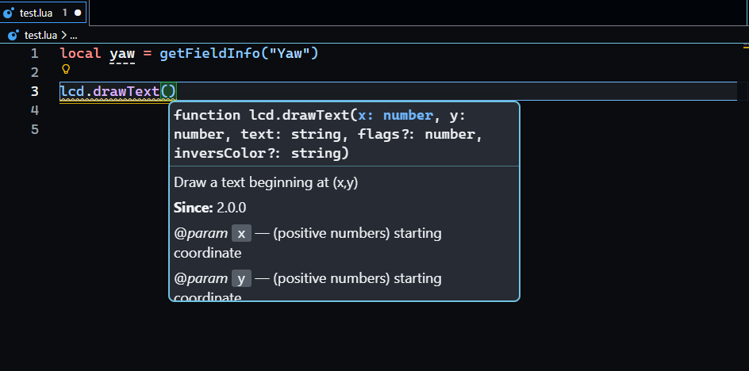
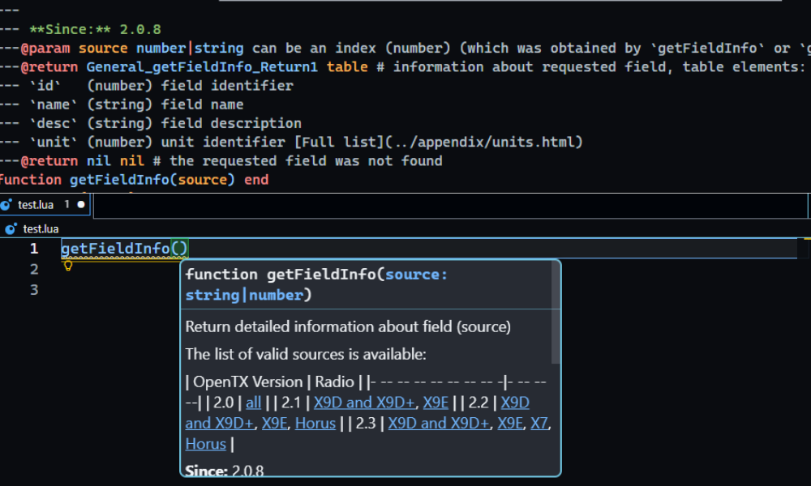

[](LICENSE)

# EdgeTX Lua API Generator

> **Automatically extracts the full EdgeTX Lua API from C++ source, generates structured JSON and LuaLS-compatible `.d.lua` stubs — and keeps them in sync with upstream EdgeTX releases.**



---

## What it does

- Fetches all `api_` source files (`api_general.cpp`, `api_colorlcd.cpp`, `api_model.cpp`, `api_filesystem.cpp` etc.) directly from the EdgeTX GitHub repo (`/repos/EdgeTX/edgetx/contents/radio/src/lua?ref=${version}`) — no local files needed
- Extracts every `/*luadoc ... */` comment block — the same source as the official EdgeTX documentation
- Scans C++ Lua registration tables for constants not covered by luadoc blocks
- Infers types (`number`, `string`, `boolean`, `table`, `nil` etc.) for every parameter and return value
- Extracts flag hints (e.g. `BOLD`, `BLINK`, `PLAY_NOW`) from parameter descriptions
- Tracks `availableOn` per function and constant: `GENERAL`, `COLOR_LCD`, or `NON_COLOR_LCD`
- Generates `.d.lua` stub files for the Lua Language Server (LuaLS) with full annotation support
- Publishes versioned stubs and a manifest to [edgetx-stubs](https://github.com/JeffreyChix/edgetx-stubs) — ready to be consumed by the [EdgeTX Dev Kit](https://github.com/JeffreyChix/edgetx-dev-kit) VS Code extension

---

## How it stays up to date

This repo runs a GitHub Actions pipeline on a schedule (Monday and Thursday) and on every push to `main`. It checks for changes in EdgeTX source files before regenerating — so no redundant work is done.

```
EdgeTX repo (upstream)
        │
        ▼
GitHub Actions (scheduled + push triggered)
        │
        ├─ Fetch source file SHAs from EdgeTX repo
        ├─ Compare against manifest — skip if nothing changed
        ├─ Parse changed sources → generate edgetx-lua-api.json and edgetx-script-types.json
        ├─ Generate .d.lua stubs per module
        ├─ Generate script type stubs (eg: telemetry script)
        ├─ Hash all output files
        └─ Commit stubs + manifest to edgetx-stubs repo
```

The VS Code extension fetches `manifest.json` silently on activation and downloads only what has changed.

---

## Output shape

Each run produces a versioned `edgetx-lua-api.json` with three top-level arrays: `functions`, `constants`, and `lvgl` plus `edgetx-script-types.json` and a set of `.d.lua` stub files per EdgeTX version.

```json
{
  "version": "2.10",
  "generated": "2026-03-14T11:16:11.396Z",
  "functions": [
    {
      "entityType": "function",
      "module": "lcd",
      "name": "drawPoint",
      "signature": "lcd.drawPoint(x, y, [flags])",
      "description": "Draw a single pixel at (x,y) position",
      "parameters": [
        {
          "name": "x",
          "type": "number",
          "description": "(positive number) x position",
          "optional": false,
          "flagHints": []
        },
        {
          "name": "y",
          "type": "number",
          "description": "(positive number) y position",
          "optional": false,
          "flagHints": []
        },
        {
          "name": "flags",
          "type": "number",
          "description": "(optional) drawing flags",
          "optional": true,
          "flagHints": []
        }
      ],
      "overloadParameters": [],
      "returns": [],
      "notices": [
        "Taranis has an LCD display width of 212 pixels and height of 64 pixels."
      ],
      "status": "current Introduced in 2.0.0",
      "sinceVersion": "2.0.0",
      "deprecated": false,
      "sourceFile": "api_colorlcd.cpp",
      "availableOn": "GENERAL"
    }
  ],
  "constants": [
    {
      "entityType": "constant",
      "name": "COLOR_THEME_PRIMARY1",
      "module": "lcd",
      "description": "Theme color. Can be changed with lcd.setColor(color_index, color).",
      "sourceFile": "api_colorlcd.cpp",
      "availableOn": "COLOR_LCD"
    }
  ],
  "lvgl": {
    "functions": [
      {
        "entityType": "function",
        "signature": [
          "lvgl.align([parent], {settings})",
          "parent:align({settings})"
        ],
        "name": "align",
        "module": "lvgl",
        "parameters": [
          {
            "name": "parent",
            "description": "Parent LGVL object. If set then whatever LVGL objects are created by the function are set as children of 'parent'. If not set then objects are created in the top level script window.",
            "type": "Lv_obj",
            "flagHints": [],
            "optional": true
          },
          {
            "name": "settings",
            "description": "Contains all of the settings required to create the LVGL object.",
            "type": "AlignSettings",
            "flagHints": [],
            "optional": false
          }
        ],
        "description": "Display a button showing a text alignment name. When tapped a popup menu is opened to choose a text alignment from. Uses EdgeTX styling.",
        "notices": [
          "The popup menu is closed when the user selects an item, and the 'set' function is called.\n\nIf the user taps outside the menu or the RTN key is pressed, the popup menu is closed and the 'set' function is not called."
        ],
        "status": "",
        "returns": [],
        "sinceVersion": "2.11.0",
        "deprecated": false,
        "overloadParameters": [
          {
            "name": "settings",
            "optional": false,
            "description": "Contains all of the settings required to create the LVGL object.",
            "flagHints": [],
            "type": "AlignSettings"
          }
        ],
        "availableOn": "COLOR_LCD",
        "sourceFile": "lvgl.align.md"
      }
    ],
    "constants": [
      {
        "name": "FLOW_ROW",
        "module": "lvgl",
        "availableOn": "COLOR_LCD",
        "entityType": "constant",
        "sourceFile": "constants.md",
        "type": "number",
        "description": "Sets flex layout flow."
      }
    ],
    "classes:": [
      {
        "entityType": "class",
        "name": "ChoiceSettings",
        "fields": [
          {
            "name": "x",
            "type": "number",
            "description": "Horizontal position of the object relative to the top left corner of the parent object.",
            "flagHints": [],
            "optional": true,
            "sinceVersion": "",
            "notices": ["Default if not set: 0"],
            "returns": []
          },
          {
            "name": "y",
            "type": "number",
            "description": "Vertical position of the object relative to the top left corner of the parent object.",
            "flagHints": [],
            "optional": true,
            "sinceVersion": "",
            "notices": ["Default if not set: 0"],
            "returns": []
          },
          {
            "name": "w",
            "type": "number",
            "description": "Width of the object",
            "flagHints": [],
            "optional": true,
            "sinceVersion": "",
            "notices": ["Default if not set: Auto size to fit content"],
            "returns": []
          },
          {
            "name": "h",
            "type": "number",
            "description": "Height of the object",
            "flagHints": [],
            "optional": true,
            "sinceVersion": "",
            "notices": ["Default if not set: Auto size to fit content"],
            "returns": []
          },
          {
            "name": "color",
            "type": "number|function",
            "description": "Primary color for the object.",
            "flagHints": [],
            "optional": true,
            "sinceVersion": "",
            "notices": ["Default if not set: COLOR_THEME_SECONDARY1"],
            "returns": []
          },
          {
            "name": "pos",
            "type": "function",
            "description": "Position of the object relative to the top left corner of the parent object.\nMust return two values - x, y.",
            "flagHints": [],
            "optional": true,
            "sinceVersion": "",
            "notices": ["Default if not set: nil"],
            "returns": [
              {
                "name": "x",
                "type": "number",
                "description": ""
              },
              {
                "name": "y",
                "type": "number",
                "description": ""
              }
            ]
          },
          {
            "name": "size",
            "type": "function",
            "description": "Size of the object. Must return two values - width, height.",
            "flagHints": [],
            "optional": true,
            "sinceVersion": "",
            "notices": ["Default if not set: nil"],
            "returns": [
              {
                "name": "width",
                "type": "number",
                "description": ""
              },
              {
                "name": "height",
                "type": "number",
                "description": ""
              }
            ]
          },
          {
            "name": "visible",
            "type": "function",
            "description": "Controls visibility of the object. Must return a boolean - true if the object is shown, false to hide it.",
            "flagHints": [],
            "optional": true,
            "sinceVersion": "",
            "notices": ["Default if not set: nil"],
            "returns": [
              {
                "name": "controls",
                "type": "boolean",
                "description": "visibility of the object. must return a boolean - true if the object is shown, false to hide it."
              }
            ]
          },
          {
            "name": "floating",
            "type": "boolean",
            "description": "If set to true then the associated object will remain fixed in place on the screen if it is within a scrollable container regardless of how the container is scrolled.\n\nCaveats:\n- has no effect if the object container is not scrollable\n- may not work as expected in flex containers\n- nested containers with more than one container having floating set to true may not work as expected",
            "flagHints": [],
            "optional": true,
            "sinceVersion": "2.11.6",
            "notices": ["Default if not set: false"],
            "returns": []
          },
          {
            "name": "title",
            "type": "string",
            "description": "Text to be displayed in the header of the popup menu.",
            "flagHints": [],
            "optional": true,
            "sinceVersion": "",
            "notices": ["Default if not set: Empty string"],
            "returns": []
          },
          {
            "name": "values",
            "type": "table",
            "description": "Must contain a simple table of strings. Each string defines an options shown in the popup menu.\n\nThe values table can be changed using the 'lvgl.set' function (in 2.11.6 or later).",
            "flagHints": [],
            "optional": true,
            "sinceVersion": "",
            "notices": ["Default if not set: Empty list"],
            "returns": []
          },
          {
            "name": "get",
            "type": "function",
            "description": "Called to get the index of the currently selected option, when the popup menu is first opened.\nMust return a number between 1 and the number of values.",
            "flagHints": [],
            "optional": true,
            "sinceVersion": "",
            "notices": ["Default if not set: nil"],
            "returns": [
              {
                "name": "called",
                "type": "number",
                "description": "to get the index of the currently selected option, when the popup menu is first opened.\nmust return a number between 1 and the number of values."
              }
            ]
          },
          {
            "name": "set",
            "type": "function",
            "description": "Called when the user taps on a menu item.\nThe function is passed a single parameter wihich is the index of the selected item (1 .. number of values)",
            "flagHints": [],
            "optional": true,
            "sinceVersion": "",
            "notices": ["Default if not set: nil"],
            "returns": [
              {
                "name": "called",
                "type": "number|function",
                "description": "when the user taps on a menu item.\nthe function is passed a single parameter wihich is the index of the selected item (1 .. number of values)"
              }
            ]
          },
          {
            "name": "active",
            "type": "function",
            "description": "Set the enabled / disabled state. Return value must be a boolean - true to enable the control, false to disable.",
            "flagHints": [],
            "optional": true,
            "sinceVersion": "",
            "notices": ["Default if not set: nil"],
            "returns": [
              {
                "name": "set",
                "type": "boolean",
                "description": "the enabled / disabled state. return value must be a boolean - true to enable the control, false to disable."
              }
            ]
          },
          {
            "name": "filter",
            "type": "function",
            "description": "Allows the popup menu list to be filtered when the user opens the popup.\nThis function is called for each option in the values table. The index of the option is passed as a parameter to the function.\nIf the function returns true the option is shown in the popup, false will hide the option.",
            "flagHints": [],
            "optional": true,
            "sinceVersion": "",
            "notices": ["Default if not set: nil"],
            "returns": [
              {
                "name": "allows",
                "type": "boolean|number|table|function",
                "description": "the popup menu list to be filtered when the user opens the popup.\nthis function is called for each option in the values table. the index of the option is passed as a parameter to the function.\nif the function returns true the option is shown in the popup, false will hide the option."
              }
            ]
          },
          {
            "name": "popupWidth",
            "type": "number",
            "description": "Set the width of the popup window.",
            "flagHints": [],
            "optional": true,
            "sinceVersion": "",
            "notices": ["Default if not set: 0 (use default width)"],
            "returns": []
          }
        ]
      }
    ]
  }
}
```

### Function fields

| Field                | Type                                          | Description                                                                  |
| -------------------- | --------------------------------------------- | ---------------------------------------------------------------------------- |
| `entityType`         | `"function"`                                  | Always `"function"`                                                          |
| `module`             | `string`                                      | Lua namespace: `"general"`, `"lcd"`, `"model"`, `"Bitmap"`                   |
| `name`               | `string`                                      | Function name                                                                |
| `signature`          | `string or string[]`                                      | Full human-readable signature from luadoc                                    |
| `description`        | `string`                                      | Doc comment body                                                             |
| `parameters`         | `LuaParam[]`                                  | Ordered list of parameters                                                   |
| `overloadParameters` | `LuaParam[]`                                  | Alternate parameter list for overloaded signatures (e.g. `rgb` vs `r, g, b`) |
| `returns`            | `LuaReturn[]`                                 | Return values — empty array means void                                       |
| `notices`            | `string[]`                                    | Warning or notice blocks from luadoc                                         |
| `status`             | `string`                                      | Raw status string from luadoc (e.g. `"current Introduced in 2.0.0"`)         |
| `sinceVersion`       | `string`                                      | Parsed version string, e.g. `"2.0.0"`                                        |
| `deprecated`         | `boolean`                                     | `true` if marked deprecated in luadoc                                        |
| `sourceFile`         | `string`                                      | Origin C++ file                                                              |
| `availableOn`        | `"GENERAL" \| "COLOR_LCD" \| "NON_COLOR_LCD"` | Screen type availability                                                     |

### Parameter fields (`LuaParam`)

| Field         | Type       | Description                                                                                                         |
| ------------- | ---------- | ------------------------------------------------------------------------------------------------------------------- |
| `name`        | `string`   | Parameter name                                                                                                      |
| `type`        | `string`   | Inferred type: `number`, `string`, `boolean`, `table`, `nil` etc.                                                   |
| `description` | `string`   | Inline doc description                                                                                              |
| `optional`    | `boolean`  | Whether the parameter is optional                                                                                   |
| `flagHints`   | `string[]` | ALL_CAPS flag/constant references parsed from the description. Non-exhaustive — treat as hints, not a complete list |

### Constant fields

| Field         | Type                                          | Description                |
| ------------- | --------------------------------------------- | -------------------------- |
| `entityType`  | `"constant"`                                  | Always `"constant"`        |
| `name`        | `string`                                      | Constant name, e.g. `BOLD` |
| `type`        | `string or number`                                      | Constant type |
| `module`      | `string`                                      | Lua namespace              |
| `description` | `string`                                      | Doc comment if available   |
| `sourceFile`  | `string`                                      | Origin C++ file            |
| `availableOn` | `"GENERAL" \| "COLOR_LCD" \| "NON_COLOR_LCD"` | Screen type availability   |

---

## Manifest

The generator maintains a `manifest.json` in the [edgetx-stubs](https://github.com/JeffreyChix/edgetx-stubs) repo. The VS Code extension uses it to silently detect when stubs need updating — without re-downloading everything every time.

```json
{
  "manifestVersion": 2,
  "updatedAt": "2026-03-16T06:00:00Z",
  "versions": {
    "2.10": {
      "generatedAt": "2026-03-16T06:00:00Z",
      "stubHash": "f7e6d5c4a3b2e1d0...",
      "sources": {
        "radio/src/lua/api_colorlcd.cpp": "fda476ff4e5bd1cccc2cc55b30176086c6fd2be2",
        "radio/src/lua/api_general.cpp": "a1b2c3d4e5f6g7h8...",
        "radio/src/lua/api_misc.cpp": "e5f6g7h8i9j0k1l2..."
      },
      "files": [
        "edgetx-lua-api.json",
        "edgetx.globals.d.lua",
        "edgetx.constants.d.lua",
        "edgetx.scripts.d.lua",
        "lcd.d.lua",
        "model.d.lua"
      ]
    }
  }
}
```

| Field             | Description                                                                                    |
| ----------------- | ---------------------------------------------------------------------------------------------- |
| `manifestVersion` | Schema version of the manifest itself. Only bumped on breaking structural changes              |
| `updatedAt`       | Timestamp of the last generation run that produced any change                                  |
| `generatedAt`     | When this specific version's stubs were last generated                                         |
| `stubHash`        | SHA-256 of all stub files combined. Extension compares this to detect if re-download is needed |
| `sources`         | Map of each parsed C++ source file path to its git blob SHA. Used to detect upstream changes   |
| `files`           | Exact list of files available for this version under `stubs/<version>/`                        |

---

## Repo structure

Generated stubs and the manifest are published to the [edgetx-stubs](https://github.com/JeffreyChix/edgetx-stubs) repo — this repo contains only the generator source and pipeline.

```
/
└── src/
    └── data/
        ├── index.ts      ← store
    └── lvgl/
        ├── gen.ts        ← Lvgl stub generator
        ├── index.ts      ← Lvgl parsing logic
    └── stub-gen/
        ├── scriptsgen.ts ← Called from `stub-gen/index.ts`. Generates .d.lua stub files from `scriptTypes.ts`
        ├── index.ts      ← Generates .d.lua stub files from the API JSON
    ├── index.ts          ← Entry point — CLI, orchestration, JSON output
    ├── fetcher.ts        ← Downloads C++ source files from the EdgeTX GitHub repo
    ├── parser.ts         ← luadoc block extraction + C++ registration table scan
    ├── typeInferrer.ts   ← Infers LuaValueType from param names and descriptions
    ├── flagLinker.ts     ← Extracts ALL_CAPS flag references from param descriptions
    ├── scriptTypes.ts    ← Handcrafted types for edgetx script types
    ├── helpers.ts        ← Helper functions
    ├── regex.ts          ← Major regular expressions
    └── types.ts          ← All TypeScript interfaces
```

---

## Setup

```bash
npm install
```

Create a `.env` file for local runs:

```
GITHUB_TOKEN=github_pat_xxxxxx
NODE_ENV=development
```

> A [fine-grained GitHub personal access token](https://github.com/settings/personal-access-tokens/new) is recommended. Set **Contents: Read and Write** on this repo only. The token raises your GitHub API rate limit from 60 to 5,000 requests/hour — necessary when fetching branch lists and source file SHAs across multiple EdgeTX versions.

---

## Usage

### Basic

```bash
# Fetch latest from GitHub (main branch) and write to stubs/
npm start

# Fetch all from GitHub and write to stubs/
npm run all

# Equivalent explicit form
npx tsx src/index.ts --version main --withstubs
```

### Options

```bash
# Fetch a specific EdgeTX version branch
npx tsx src/index.ts --version 2.10 --withstubs

# Fetch ALL numeric version branches from the EdgeTX repo
npx tsx src/index.ts --version all --withstubs

# Custom output directory (default: stubs/)
npx tsx src/index.ts --version 2.10 --outDir ./releases/2.10 --withstubs
```

### CLI flags

| Flag              | Default | Description                                                             |
| ----------------- | ------- | ----------------------------------------------------------------------- |
| `--version <ver>` | `main`  | EdgeTX version branch to fetch. Use `all` to fetch every numeric branch |
| `--outDir <path>` | `stubs` | Directory to write JSON and stubs                                       |
| `--withstubs`     | off     | Generate `.d.lua` stubs alongside the JSON                              |

---

## Stub generation

Stubs are generated as part of extraction via `--withstubs` and published to [edgetx-stubs](https://github.com/JeffreyChix/edgetx-stubs). The generator produces one `.d.lua` file per Lua module, derived from the module prefix in each function's name (e.g. `lcd.drawText` → `lcd.d.lua`). Functions with no module prefix land in `edgetx.globals.d.lua`.

```
stubs/2.3 to 2.10/
├── edgetx-lua-api.json       ← full merged API, all sources
├── edgetx-script-types.json  ← edgetx script types
├── edgetx.globals.d.lua      ← global functions (no module prefix)
├── edgetx.constants.d.lua    ← all constants grouped by module
├── edgetx.scripts.d.lua      ← script types
├── edgetx.lcd.d.lua          ← lcd.* namespace
├── edgetx.model.d.lua        ← model.* namespace
├── edgetx.bitmap.d.lua       ← Bitmap.* namespace
└── ...                       ← any future modules are handled automatically

stubs/2.11 to latest/
├── edgetx-lua-api.json       ← full merged API, all sources
├── edgetx-script-types.json  ← edgetx script types
├── edgetx.globals.d.lua      ← global functions (no module prefix)
├── edgetx.constants.d.lua    ← all constants grouped by module
├── edgetx.scripts.d.lua      ← script types
├── edgetx.lcd.d.lua          ← lcd.* namespace
├── edgetx.lvgl.d.lua         ← all lvgl APIs // introduces in 2.11
├── edgetx.model.d.lua        ← model.* namespace
├── edgetx.bitmap.d.lua       ← Bitmap.* namespace
└── ...                       ← any future modules are handled automatically
```

Each file uses [LuaCATS annotations](https://luals.github.io/wiki/annotations/) (`---@param`, `---@return`, `---@overload`, `---@class`, `---@deprecated` etc.) for full IntelliSense support in the Lua Language Server.

## 

## CI / GitHub Actions

The pipeline runs automatically. No manual intervention is needed for routine updates.

| Trigger             | Behaviour                                                           |
| ------------------- | ------------------------------------------------------------------- |
| `push` to `main`    | Always regenerates — your generator code may have changed           |
| `schedule`          | Regenerates only if any EdgeTX source file SHA has changed upstream |
| `workflow_dispatch` | Always regenerates — useful for manually forcing a fresh run        |

The source SHA check means the scheduled run is a no-op most of the time — it only does real work when EdgeTX actually changes a Lua API file.

---

## Contributing

The generator is intentionally structured so new EdgeTX modules require no code changes — any function with an unrecognised module prefix automatically gets its own stub file. If you find a parsing gap or a type inference miss, the relevant files are `parser.ts` and `typeInferrer.ts`.
